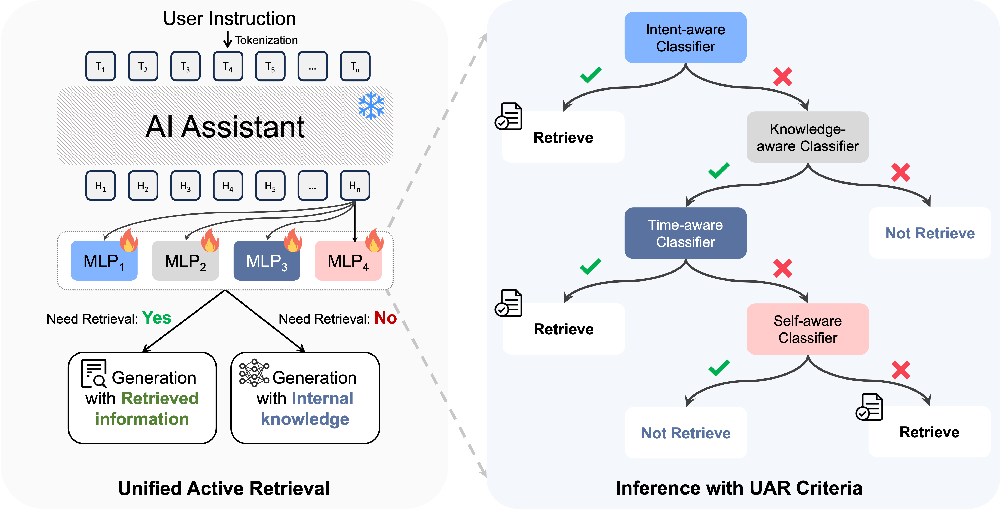

# UAR: Unified Active Retrieval for Retrieval Augmented Generation

This is the official repository for the paper [Unified Active Retrieval for Retrieval Augmented Generation](https://arxiv.org/pdf/2406.12534).

## Abstract
In Retrieval-Augmented Generation (RAG), retrieval is not always helpful and applying it to every instruction is sub-optimal. Therefore, determining whether to retrieve is crucial for RAG, which is usually referred to as Active Retrieval.  
We propose Unified Active Retrieval (UAR). UAR contains four orthogonal criteria and casts them into plug-and-play classification tasks, which achieves multifaceted retrieval timing judgements with negligible extra inference cost. We further introduce the Unified Active Retrieval Criteria (UAR-Criteria), designed to process diverse active retrieval scenarios through a standardized procedure. Experiments on four representative types of user instructions show that UAR significantly outperforms existing work on the retrieval timing judgement and the performance of downstream tasks, which shows the effectiveness of UAR and its helpfulness to downstream tasks.



## Training

### Preparing the Environmen

```
git clone https://github.com/xiami2019/UAR.git
cd UAR
pip install -U pip setuptools
pip install --extra-index-url https://download.pytorch.org/whl/test/cu118 -e .
```

### Preparethe Dataset

```
unzip training_data.zip
unzip benchmarks.zip
unzip results.zip
```

### Classifier Training

```python
python llama_recipes/finetuning.py \
    --model_name meta-llama/Llama-2-7b-chat-hf\
    --output_dir time_aware_llama2-7b-chat \
    --dataset time_aware_cls_ce \
    --batch_size_training 32 \
    --batching_strategy padding \
    --lr 5e-5 \
    --num_epochs 10 \
    --reward_model_loss_type "ce" \
    --only_cls_for_rmce
```

```python
python llama_recipes/finetuning.py \
    --model_name meta-llama/Llama-2-7b-chat-hf\
    --output_dir knowledge_aware_llama2-7b-chat \
    --dataset knowledge_aware_cls_ce \
    --batch_size_training 32 \
    --batching_strategy padding \
    --lr 5e-5 \
    --num_epochs 10 \
    --reward_model_loss_type "ce" \
    --only_cls_for_rmce
```

```python
python llama_recipes/finetuning.py \
    --model_name meta-llama/Llama-2-7b-chat-hf\
    --output_dir self_aware_llama2-7b-chat \
    --dataset self_aware_cls_ce_llama2_7b_chat \
    --batch_size_training 32 \
    --batching_strategy padding \
    --lr 5e-5 \
    --num_epochs 10 \
    --reward_model_loss_type "ce" \
    --only_cls_for_rmce
```

```python
python llama_recipes/finetuning.py \
    --model_name meta-llama/Llama-2-7b-chat-hf\
    --output_dir intent_aware_llama2-7b-chat \
    --dataset intent_aware_cls_ce \
    --batch_size_training 32 \
    --batching_strategy padding \
    --lr 5e-5 \
    --num_epochs 10 \
    --reward_model_loss_type "ce" \
    --only_cls_for_rmce
```

## Evaluation

### Active Retrieval Judgement

#### AR-Bench Inference
```python
python uar_infer.py \
    --model_name meta-llama/Llama-2-7b-chat-hf \
    --prompt_file benchmarks/AR_bench/ar_bench_llama2-7b-chat.json \
    --save_name results/AR_bench/my_ar_bench_7b_uar_output.json \
    --data_type normal \
    --batch_size 8
```

#### GSM8K Inference

```python
python uar_infer.py \
    --model_name meta-llama/Llama-2-7b-chat-hf \
    --prompt_file benchmarks/downstream_tasks/gsm8k_test_with_ret.json \
    --save_name results/downstream_tasks/my_gsm8k_test_llama2_7b_chat_uar.json \
    --data_type gsm8k \
    --batch_size 8
```

#### Drop Inference

```python
python uar_infer.py \
    --model_name meta-llama/Llama-2-7b-chat-hf \
    --prompt_file benchmarks/downstream_tasks/drop_dataset_dev_passage_qa_with_ret.json \
    --save_name results/downstream_tasks/my_drop_output_llama2_7b_chat_uar.json \
    --data_type drop \
    --batch_size 8
```

#### TriviaQA & WQ & TAQA & FreshQA

```python
python uar_infer.py \
    --model_name meta-llama/Llama-2-7b-chat-hf \
    --prompt_file benchmarks/downstream_tasks/triviaqa_with_ret.json \
    --save_name results/downstream_tasks/my_triviaqa_llama2_7b_chat_results_uar.json \
    --data_type normal \
    --batch_size 8
```

### Response Generation

#### GSM8K

```python
python vllm_infer.py \
    --model_path  meta-llama/Llama-2-7b-chat-hf\
    --input_file results/downstream_tasks/gsm8k_test_llama2_7b_chat_uar.json \
    --output_file results/downstream_tasks/gsm8k_test_llama2_7b_chat_uar_generation_results.json \
    --data_type gsm8k
```

#### Drop

```python
python vllm_infer.py \
    --model_path  meta-llama/Llama-2-7b-chat-hf\
    --input_file results/downstream_tasks/drop_output_llama2_7b_chat_uar.json \
    --output_file results/downstream_tasks/drop_output_llama2_7b_chat_uar_generation_results.json \
    --data_type drop
```

#### TriviaQA & WQ & TAQA & FreshQA

```python
python vllm_infer.py \
    --model_path  meta-llama/Llama-2-7b-chat-hf\
    --input_file results/downstream_tasks/triviaqa_llama2_7b_chat_results_uar.json \
    --output_file results/downstream_tasks/triviaqa_llama2_7b_chat_results_uar_generation_results.json \
    --data_type normal
```

### Compute Results

#### Downstream tasks

##### Drop  

```python
python /evaluations/drop_eval.py \
    --gold_path benchmarks/downstream_tasks/drop_dataset_dev.json \
    --prediction_path results/downstream_tasks/drop_output_llama2_7b_chat_uar.json \
    --output_path results/downstream_tasks/drop_output_llama2_7b_chat_uar_eval_output.json
```

##### GSM8K  

```python
python /evaluations/gsm8k_eval.py \
    --file_name results/downstream_tasks/gsm8k_test_llama2_7b_chat_uar.json
```

##### TriviaQA & WQ

```python
python /evaluations/em_eval.py \
    --file_name results/downstream_tasks/triviaqa_llama2_7b_chat_results_uar.json
```

##### TAQA & FreshQA

Directly compute accuracy on TAQA dataset using our provided ChatGPT evaluation reuslts.
```python
python evaluations/chatgpt_acc.py --input_file results/downstream_tasks/freshqa_without_false_premise_time_change_llama2_7b_chat_als_ret.json --only_cal_acc
```  

Evaluate using ChatGPT API: First provide your openai_api_key and base_url in evaluations/api_keys_config.json, then:  
```python
python evaluations/chatgpt_acc.py --input_file results/downstream_tasks/freshqa_without_false_premise_time_change_llama2_7b_chat_als_ret.json --output_file results/downstream_tasks/test.json
```
We use [GPTWrapper](https://github.com/Luther-Sparks/GPTWrapper) for ChatGPT API calling. Thanks to Mianqiu~

#### AR-Bench

```python
python evaluations/cal_ar_acc.py \
    --file_name results/AR_bench/ar_bench_llama2-7b-chat_uar_output.json
```

